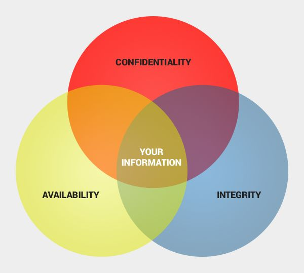
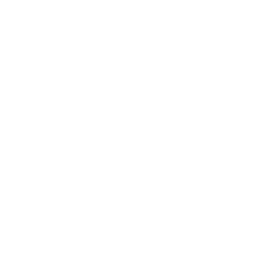
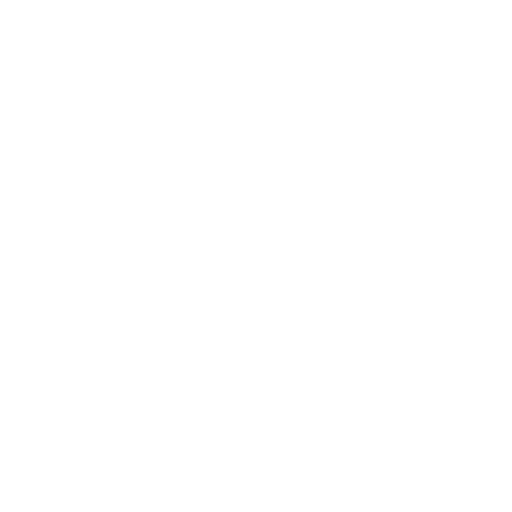
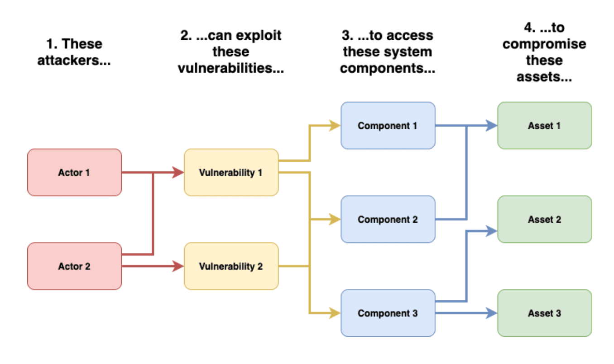

# Metadata
This is the markdown transcript for a presentation held on Tuesday, March 12th.

- [Presentation in PDF form](static/opsec/opsec.pdf)
- [Presentation as an interactive website](static/opsec/opsec.html)
- Source on [GitHub](https://github.com/Olympicene/opsec-presentation)

# Threat Modeling 101
## Intro to Operational Security

## What is Security
"Security is a property (or more accurately a collection of properties) that hold in a given system under a given set of constraints"

- System
    - anything from hardware, software, firmware, and information being processed, stored, and communicated
- Constraints
    - define an adversary and their capabilities

## What is Operational Security (OpSec)
"Operational security (OPSEC) is a security and risk management process that prevents sensitive information from getting into the wrong hands."[1]

### Who uses Operation Security?

  
  
  

- Government
- Enterprise
- You!

<!-- Simpler examples of OpSec? -->

## Why is OpSec Important
This is mainly aimed at companies:

- Protection of Sensitive Information
    - Prevent customer sensitive customer info from being stolen
- Preservation of Privacy
    - Intangible property right
    - Right to be let alone
    - Right to be anonymous
    - Right to control who, when, where, and how information about us is shared
- Mitigation of Threats
    - If something bad happens, it wont be *as* bad
- Maintaining Operational Continuity
    - Stop everything from going to a complete standstill

## Core Principles of OpSec

### Confidentiality
Ensures that sensitive information is only accessible to authorized individuals or systems, preventing unauthorized disclosure.

### Integrity
Guarantees that data remains accurate, complete, and unaltered during storage, transmission, and processing, maintaining its reliability and trustworthiness.

### Availability/Accessibility
Ensures that systems and resources are accessible and operational when needed, minimizing downtime and disruptions to critical services or functions.

### Accountability
Establishes responsibility for actions taken within the system, enabling traceability and accountability for security incidents or breaches.

## What is Threat Modeling?
Definition of threat modeling:

"Threat modeling is the process of using hypothetical scenarios, system diagrams, and testing to help secure systems and data." [1]

### Images of Common Hypotheticals
How does an SQL injection effect CIA?

- it effects the integrity

  
  
  

Go over common threats you might face in your own deployments.

- SQL Injections
- DDOS Attacks
- Security Breaches

## Purposes of Threat Modeling
- As we discussed with hypotheticals, threat modeling...
    - Identifies Potential Risks
        - Where is it coming from
    - Helps us understand common Attack Vectors
        - How are they doing it
    - Prioritizes Security Concerns
        - What should we address first

KEY THING: Do all this *before* the incident happens

## Benefits of Threat Modeling
- Proactive Risk Management
    - We address risks before they are tested in reality
- Promotes Continuously Improvement
    - Threat modeling occurs constantly so policy does not stagnate
- Prioritizing risks saves time and $$$
    - Knowing what is most important saves time, energy, and resources

<!-- - Shared Collaboration -->
<!-- Not really need to talk about this -->

## Overview of Threat Modeling Process
There are many different well-defined processes for Threat Modeling

But we will use this simplified model for our usecase

<https://owasp.org/www-community/Threat_Modeling_Process>
<https://www.praetorian.com/blog/what-is-threat-modeling-and-why-its-important/>

- Set of assumptions about possible attacks that a system tries to protect
against
- Understanding potential threats is crucial for taking appropriate measures
- Various threat modeling approaches: attacker-centric, software-centric,
asset-centric, ...

### Example: data flow approach
- View the system as an adversary: identify entry/exit points, assets, trust levels, usage
patterns, ...
- Characterize the system: identify usage scenarios, roles, objectives, components,
dependencies, security alerts, implementation assumptions, ...
- Identify threats: what can the attacker do? How? What is the associated risk? How can
the respective vulnerabilities be resolved?

## Key Concepts in Threat Modeling

#### Assets
Identifying and categorizing valuable resources

#### Threats
Recognizing potential risks and actors

#### Vulnerabilities
Understanding weaknesses in systems or processes

#### Risks
Assess likelihood and impact of threats exploiting vulnerabilities

## Threat Modeling: Assets 
- Types of assets
    - data
        - databases, codebases, paper information
    - hardware
        - servers, computers, routers, product samples/prototypes
    - software
        - 3rd party software that you may yes, pipelines, middlemen
    - personnel
        - people who have access to stuff, important people

 
## Threat Modeling: Threats
- External threats
    - hackers
        - government, organizational, personal
    - malware
        - viruses worms rootkits trojan horses keyloggers RATs backdoors downloaders droppers injectors dialers flooders adware spyware ransomware
    - phishing attacks
- Internal threats
    - improper access
    - sabotage

## Threat Modeling: Vulnerabilities
“A property of a system or its environment which, in conjunction with an internal or external threat, can lead to a security failure, which is a breach of the system’s security policy.”

- Classifications
    - Abstraction level
        - low vs high level, OSI network layers, hardware/firmware/OS/middleware/application, system vs. process, ...
    - Type of error/condition/bug
        - memory errors, range and type errors, input validation,
    race conditions, synchronization/timing errors, access-control problems, environmental/
    system problems (e.g. authorization or crypto failures), protocol errors, logic flaws, ...
    - Age: zero-day vs. known
    - Disclosure process
        - private vs. public, “responsible” vs. full disclosure, ...

Multiple vulns. are often combined for a single purpose

## Assessing Risks
- Vulnerability assessments: 
    - penetration testing
        - White hat/ Grey Hat Hackers
    - code reviews
        - Enforced on the software side, unit testing
    - attacker reconnaissance
        - Passive reconnaissance: no direct interaction with the target system
            Information gathering from public sources
            Google Dorking  
        - Passive network eavesdropping
        - Dumpster diving (e.g., recover data from discarded hard drives)
            - Information leakage  

        - Active reconnaissance: attacker’s activities can be directly detected and
        logged
            - Network scanning
            - Service enumeration
            - OS and service fingerprinting/probing
            - Social engineering
- Risk assessment methodologies
    - qualitative vs. quantitative
    - likelihood and impact
        <!-- based on likelihood and impact -->

## OpSec in Practice
Threat model ➔ security policy ➔ security mechanisms

Security policy: a definition of what it means for a system/
organization/entity to be secure

Access control, information flow, availability, ...

Computer, information, network, application, password, ...

Enforced through security mechanisms

- Prevention
- Detection
- Recovery

### What does OpSec actually look like in practice
- Access controls to protect assets
    - you know some method of controlling who has access
    - filter list, rules based, attribute based, mandatory access top level access
- Encrypting sensitive data 
    - in transit and at rest
- Protect Confidentiality
    - Conduct regular security audits
- Updates to software introduce new vulnerabilities all the time
- Not all countermeasures are technical

## Tools and Techniques for Threat Modeling
- Threat modeling frameworks: STRIDE, DREAD, PASTA
- Threat modeling tools: 
    - Microsoft Threat Modeling Tool, 
    - OWASP Threat Dragon
- Manual vs. automated threat modeling approaches vs TMaaS

## Case Studies: Real-world Examples
- Target data breach
- Stuxnet worm
- Equifax data breach
- <https://www.bleepingcomputer.com/tag/zero-day/>

## Threat Modeling for You

## Integrating into Your Security Strategy (Corpos)

- Incorporating threat modeling into the software development lifecycle (SDLC)
- Aligning threat modeling with compliance requirements (e.g., GDPR, HIPAA)
- Building a culture of security awareness and accountability

## Challenges and Limitations 
- Complexity of systems and evolving threats
- Resource constraints: time, expertise, budget
- Over-reliance on threat modeling as a sole security measure
- No security mechanism is free
    - Direct costs: Design, implementation, enforcement, false positives
    - Indirect costs: Lost productivity, added complexity
- Challenge is to rationally weigh costs vs. risk
    - Human psychology makes reasoning about high cost/low
    probability events hard

## Future Trends in Threat Modeling
- AI and machine learning for automated threat detection and response
- Integration of threat intel feeds into threat modeling processes
- Emphasis on other proactive and adaptive threat modeling approaches

## Thank you

[1] - <https://www.fortinet.com/resources/cyberglossary/operational-security>

<https://www.cisco.com/c/en/us/products/security/what-is-threat-modeling.html>

<https://radiumhacker.medium.com/threat-modelling-frameworks-sdl-stride-dread-pasta-93f8ca49504e>

Presentation made by Kevin Cordero

Icons made by <a href="https://www.flaticon.com/authors/dewi-sari" title="Dewi Sari"> Dewi Sari </a> from <a href="https://www.flaticon.com/" title="Flaticon">www.flaticon.com'</a>

