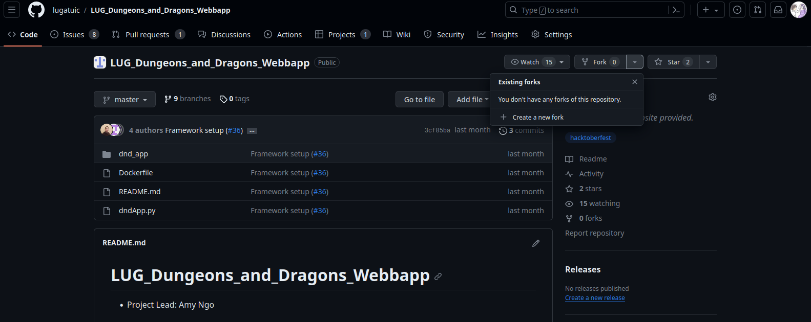
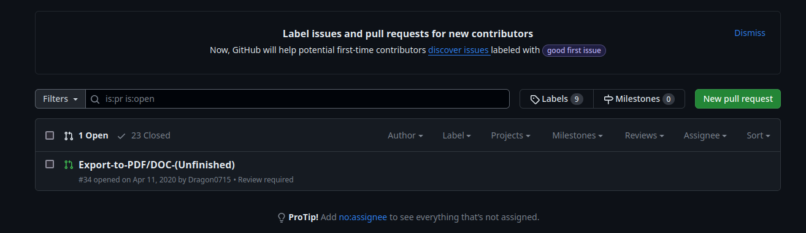
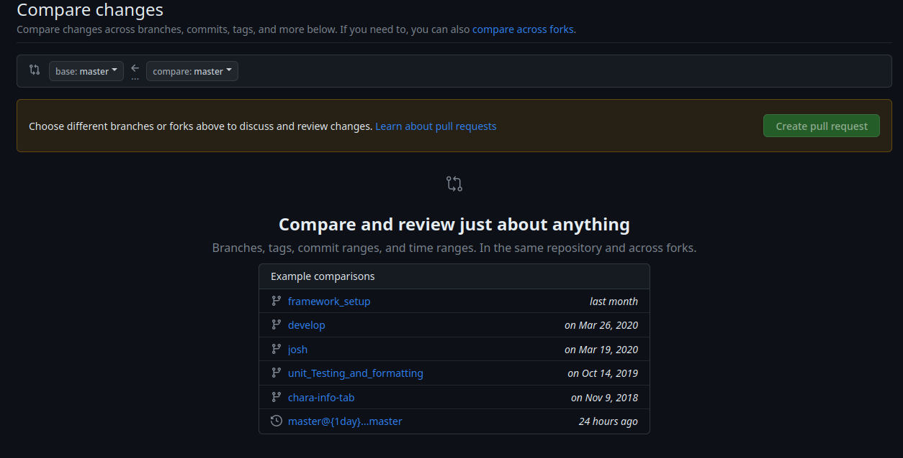

---
author:
- Osamudiamen Okundaye/ Double O
date: October 23rd, 2023
subtitle: A LUG workshop
title: Git Pull Requests
---

:::

### Overview
:::

# Pull Requests

## What are they?

## How to make one?

## What happens if you do it wrong?

# First hand experience

## You get to contribute

### Pull Requests?

1.  Also known as \"Merge Requests\"

2.  Fork a repo and make changes locally

3.  push changes to the fork repo

4.  request if your changes can join main repo

5.  merged into main repo
:::

### Where to start?

1.  Draft your request

    1.  Don't be lazy.

    2.  Details, they are important.

2.  Now it's the main developer(s) turn

    1.  They have final say on your pull requests

    2.  If you made a good pull request it gets merged

    3.  If you don't it gets denied

    ::: alertblock
    WARNING PLEASE CHECK FOR UPDATES TO THE MAIN REPO BEFORE DOING A
    PULL REQUEST!
    :::
:::

What happens if a bad pull requests get through?

1.  Merge conflicts

2.  headaches everywhere

3.  lots of yelling and screaming

4.  someone usually gets the shortest end of the stick
:::

Visual 1

{#fig:how to fork}
:::

Visual 2

{#fig:pull request window}
:::

Visual 3

{#fig:CC Window}
:::
