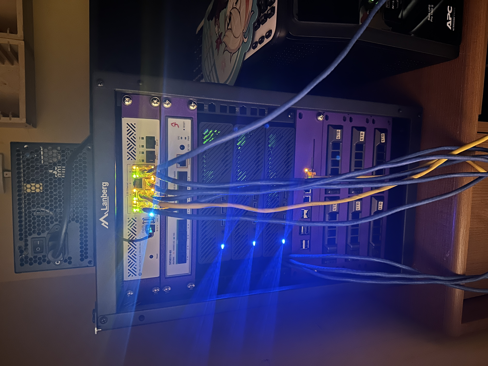
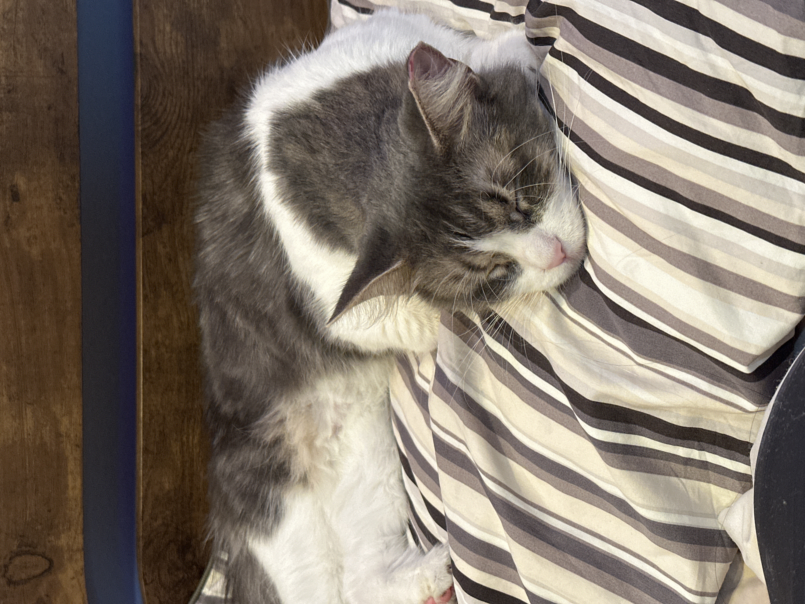
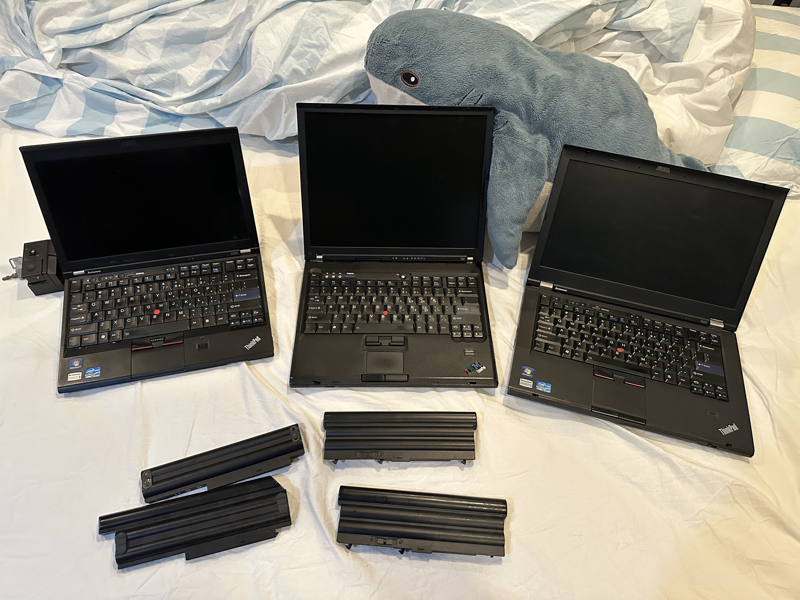
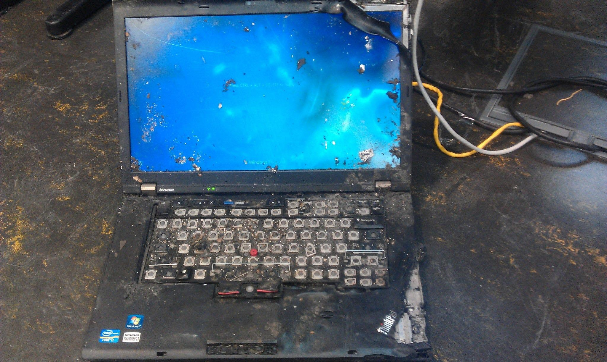
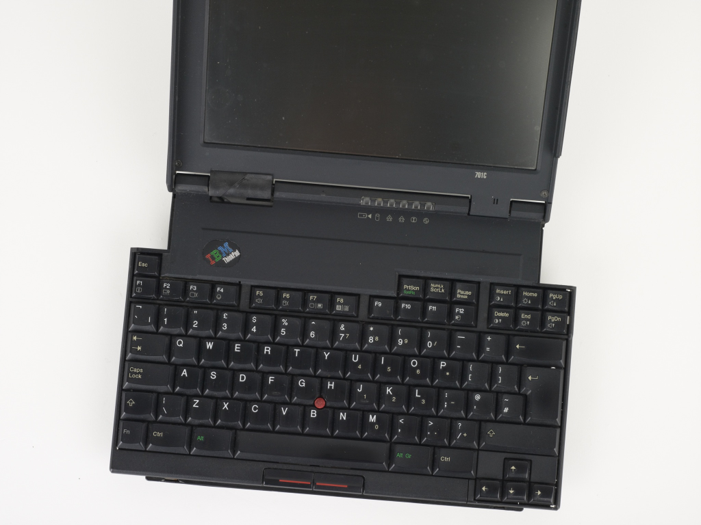

# Metadata

This is the markdown transcript for a presentation held on November 20th. You
can find the writeup in PDF format [here](https://github.com/lowpolyneko/thinkpads-2025/blob/main/thinkpads-2025.handout.pdf).

## Video Recording

<iframe src='https://www.youtube.com/embed/xJaMFnleSQQ' frameborder='0' allowfullscreen></iframe>

# About Me

- Ethan Wong
- Contact: [`ewong@anl.gov`](mailto:ewong@anl.gov)
- Post Baccalaureate Appointee
  - High-performance computing
  - Distributed systems[^1]
  - Systems performance
  - Concurrency and parallelism
- Personal Interests
  - NixOS user
  - FOSS contributor
  - Homelabber
  - VR enthusiast
  - Rhythm game enjoyer
- Ex-LUG president

{width="\\textwidth"}

{width="\\textwidth"}

# ThinkPads?

## What?

So. I have a bit of a problem\...

I own *too* many ThinkPads.

{width="75%"}

## What are ThinkPads?

### Definition

ThinkPads are a line of *business laptops* manufactured by
Lenovo[^2]. They have been in production since 1992!

{width="80%"}

## Why?

Why? Why are these laptops so special?

- They're ubiquitous!
  - Businesses buy these in droves
  - Built to be reliable and [repairable]{.underline} for its lifespan
  - Businesses offload these in droves :3
    - Cheap!!!!
    - and easy to find good condition liquidations\...
- Linux support is first-class
- They're durable!

{width="\\textwidth"}

### Repairability

ThinkPads, particularly older generations, are extremely
repairable.

- Socketed CPUs
- Socketed RAM
- Replaceable SSDs/CD drives/HDDs
- Replaceable WiFi cards
- Hot-swap keyboard
  - screen
  - trackpad
- Detachable battery!

### Quality of Life

In addition\...

- Good port selection!
  - USB-A
  - DisplayPort/HDMI
  - SD Card
  - Ethernet
  - VGA
  - Serial
- IMO the best keyboard in any laptop
- TrackPoint

# History by Example

## Pre-Lenovo

Up until 2005, IBM manufactured ThinkPads as part of their PC
hardware division.

{width="40%"}

Then, IBM sold their PC hardware division to Lenovo, who has been
producing ThinkPads since.

## New(-er) Generations

**Showcase!**

# Hardware Modding

## Modding

- Older models can flash a custom BIOS[^3]
- 1080p screen mod
- Keyboard swaps
- Trackpad swaps
- Custom motherboards (and even entire machines!)
  - Chinese modders (51nb) have developed custom motherboards with new
    Intel CPUs for old-generation ThinkPads

# Procurement

<https://www.ebay.com>

# Closing Remarks

**Thank you!**

*I'll stick around to chat afterwards\...*

**Officers**

{width="60%"}

The information in this presentation will be made available on the
LUG website!\
<https://lug.cs.uic.edu>

Join the LUG Discord!

{width="50%"}

[^1]: particularly commodity clusters
[^2]: and formerly IBM
[^3]: sometimes FOSS!
