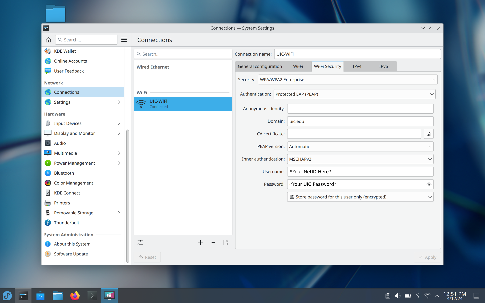
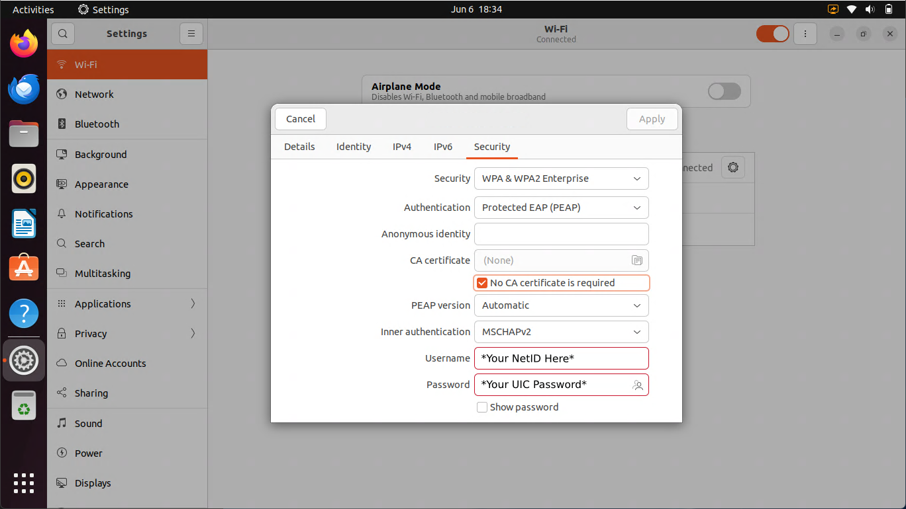

This article assumes that you both have the correct wireless drivers installed, and that you are connecting to the network on UIC's campus.

To connect to the main wireless network on campus, make sure that you are connecting to **UIC-WiFi**.

When attempting to connect to the network, you will be prompted for the following information:

| Field | Input |
| ----- | ----- |
| EAP Method | Protected EAP (PEAP) |
| Phase 2 Authentication | MSCHAP |
| CA Certificate | Don't Validate / None |
| Domain | uic.edu |
| Identity | **Your UIC NetID** [^1]|
| Anonymous Identity | Anonymous |
| Wireless Password | **Your UIC Password** |

[^1]: Your NetID is your UIC email, minus the `@uic.edu`.
